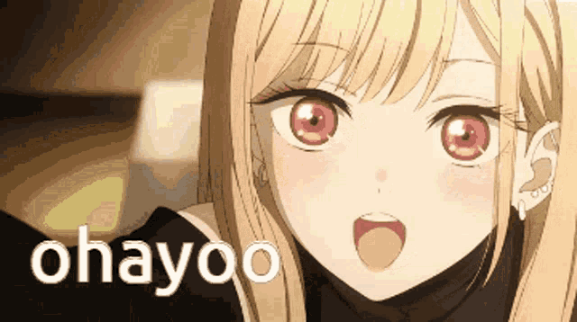

# Kokoro-Connect

おはよう (Ohayo), we are team ILoveIU. In IU Hackathon - Overcome the pressure, we bring to our society a wonderful application. Our product aims to bring people close together and spread happiness everywhere.

## Inspiration
"_Sharing and helping are important keys to reaching the meaningful happiness_"  
We believe that the most happiness in the world is to share happiness to others. If true, our product is a place that people can connect and help the others.

## About Kokoro Connect
Kokoro Connect (Kokoro means "heart" in english) is a platform for society. The targets of our platform:  
- Help individuals connect to volunteer organizers and vice versa.
- People can connect together and start a volunteer campaign.
- A place for people to find volunteer activities.

## About us
We are ILoveIU and we are from [HCMUS](https://www.hcmus.edu.vn/). 